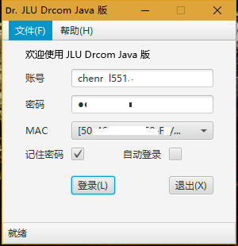
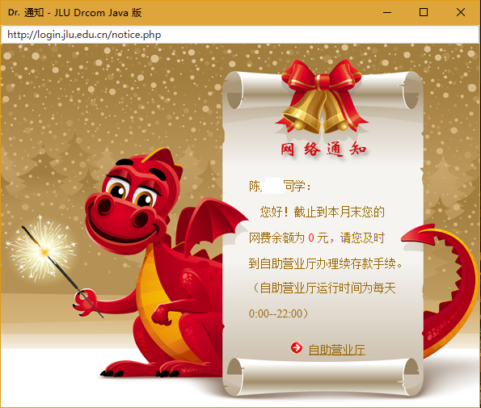
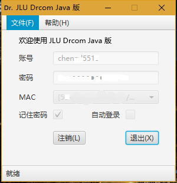
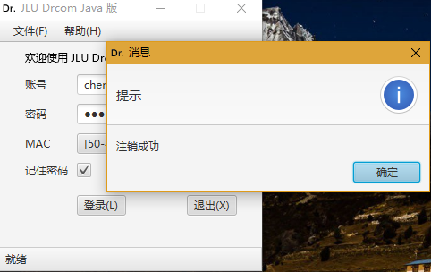
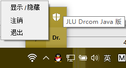
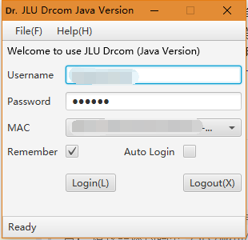

# jlu-drcom-java
吉林大学校园网登录客户端 Java 版（第三方）  
>项目地址： 
>- https://github.com/YouthLin/jlu-drcom-client/tree/master/jlu-drcom-java  
>- https://github.com/drcoms/jlu-drcom-client/tree/master/jlu-drcom-java  

## 特性
- 可共享 WiFi
- 图形化界面
- 跨平台
- 记住密码
- 自动登录
- 保持在线
- 密码加密存储
- 多语言支持

## 下载
点此链接选择最新版下载 [http://dwz.cn/drcombin](http://dwz.cn/bindrcom) (https://github.com/YouthLin/jlu-drcom-client/tree/master/jlu-drcom-java/bin)    
如果您有兴趣,可以填一下调查问卷: [http://dwz.cn/javadrcomwj](https://wj.qq.com/s/1036693/3e7b)  
或扫码填写:  

## 项目来源
周一(2017-01-9)回到学校发现原来的旧版客户端已经不能使用了，
但是新版客户端总是会检测我是否共享了 WiFi 导致根本无法使用网络
（共享给自己的 Windows10/Android/iOS 手机使用，一个账户登录不了这么多），

然后想到了 GayHub 上有 Python 版，C 语言版的客户端，
(早就下载过的，因为在 Linux 下很方便)，但是发现一个问题，
Python 版在 Windows 下我不知道咋让他在后台运行2333. 得一直保持
DOS 窗口打开，而 C 语言版由于引用的头文件在 Windows 下不兼容编译不了
（虽然可以改成引用 Win32 库，但是嫌麻烦）

于是一气之下打算自己用 
Java 写一个 GUI 版本的客户端，因此就有了项目。

## 使用前提
本软件依赖 Java 8 环境。
>如果您没有 Java 环境  
请您到 http://java.com 下载最新版 Java. (Java 8)  
相信我，这花不了几分钟.  

> 如果您已有 Java 环境  
通常安装 Java 后即可直接双击 `.jar` 文件打开软件,
 如果没有反应, 请尝试在命令行中运行
`javaw -jar jlu-drcom-java.jar` 
或 `java -jar jlu-drcom-java.jar` .  

**若您并不想安装 Java 那么本软件不适合您，
请您`立即`关闭本页面以免浪费您宝贵的时间。**

>如果您因为没有 Java 环境而运行不了本软件，请您不要急着骂作者，
毕竟他原来只是打算写给自己使用的。虽然作者很乐意看到更多的同学
使用这个小软件，但如何应对 连 Java 都不会安装的用户 
作者的确不想多费口舌，感谢您的理解。
（实际上作者想过自带 Java 环境一起发布，但是 JRE 太大了；
也想过手动精简 JRE 但是略麻烦，因此只发布了 jar 可执行包）

## 基本使用
- 主界面  
  
账号输入您的吉大邮箱账号（略去 @ 符号及之后的部分），
密码是您吉大邮箱的密码；
通常程序会自动检测到您的 MAC 地址，
因此 MAC 可以保持默认；
至于记住密码和自动登录选项可以根据需要勾选. 
  >当勾选了“记住密码”时，将会在用户主目录保存您的信息，
具体目录是 `${user.home}/.drcom/conf/drcom.java.conf` .

  >当勾选了“自动登录”时，将会自动勾选“记住密码”.  

- 登录成功通知  
  
当登录成功后，主界面将会自动隐藏到托盘, 然后将会弹出校园网通知. 
  
  >当您账户余额不足时，将会出现上图所示画面，
请及时缴费以免断网.  (通常，最多可以欠费 40 RMB) 
 
  >欠费了也想看校园网通知? 试试 http://login.jlu.edu.cn/notice_info.php   

- 登录成功  
  
当然，您可以随时通过点击托盘图标打开主界面, 这没什么好说的. 

- 注销  
  
点击注销按钮将会注销此次登录并弹出提示.  

  >当程序出现异常时，比如登录时发现您的密码不正确，
也会弹出提示框.  

- 托盘  
  
（JavaFx 目前没有很好的方法支持托盘，
因此使用的是 Java Swing 技术，
导致右键菜单风格略微不一致）

## 高级
- 配置
如果您选择了记住密码，配置文件将保存在用户主目录下的 `.drcom/conf` 目录下。
实际上您可以手动修改配置文件中的 MAC 地址
（例如，极少同学可能使用的是路由器的 MAC 地址\[并不提倡有违校方意愿的做法\]）
那么可以在配置文件中修改，程序启动将会读取配置。

- 日志  
日志目录：`.drcom/logs/`. 
默认地，程序将不会记录很多日志，如果您发现程序出现异常，
请您通过 `javaw -Dlog.level=trace -jar jlu-drcom-java.jar` 启动程序，
若您觉得有必要，还可以将出现的问题及日志文件发给作者帮助改进本项目。

- 快捷键  
屏幕上都写了，按钮是使用 `ALT+KEY` 的方式. 还有没写的 `CTRL+W` 您可以试试.  

- 协议  
通过 Wireshark 抓包我们可以了解到 drcom 协议的更多细节，
同时我还发现了现有脚本的若干小问题，
您可以在 [jlu-drcom-protocol.md](jlu-drcom-protocol.md)
中阅读更多。

## 1.0.1 版更新内容
- 新增：「查看校园网通知」菜单项
- 新增：浏览器 ALT+Left/Right 前进后退(虽然并没有人会用)
- 改进：密码存储策略，不再是明文存储，conf 文件
- 修复：Linux 下的对话框「查看详情」导致界面错乱

## 1.0.2 版更新内容
- 改进：细节上的用户体验
- 新增：多语言支持
> 可通过启动参数 `-Duser.language=en` 体验英语环境界面, 
> 暂只支持中英语言, 若想支持其他语言，
> 请按照源代码中 `/src/main/resource/Drcom_zh.po` 
> 模板编写目标语言 po 文件(您可能需要使用 PoEdit 等翻译软件)
> 然后发起 PR 请求.  
- 英文界面  
  

## TODO
开学后收集反馈

## 鸣谢
- 感谢 [jlu-drcom-client](https://github.com/drcoms/jlu-drcom-client) 中
[newclient.py](https://github.com/drcoms/jlu-drcom-client/blob/master/newclient.py), 
[drcom-android](https://github.com/drcoms/jlu-drcom-client/tree/master/drcom-android) 等
项目提供的前驱知识，本项目得以完成离不了前辈们的探索，致谢！
- 感谢吉林大学 IBM 俱乐部副主席在本项目期间提供的各种帮助。

## CopyLeft
jar 可执行软件采用 [ 署名 - 非商业性使用 - 相同方式共享 4.0 国际 (CC BY-NC-SA 4.0)](https://creativecommons.org/licenses/by-nc-sa/4.0/deed.zh) 
进行授权。
您可以自由地使用、修改、复制、传播本作品，
但是需要注明来源（链接到本页面即可）
并且不能用于任何商业用途；您通过本作品演绎的作品也需要遵守本协议或兼容的协议。

此软件仅用于学习交流使用，请勿用于商业用途，
引用本项目的任何代码请注明出处并链接到本页面，
感谢您的理解与配合。

请您在不违反 校规和/或任何有效约束 的前提下使用本软件。

## LICENSE
此项目源代码遵循 AGPL 协议。
